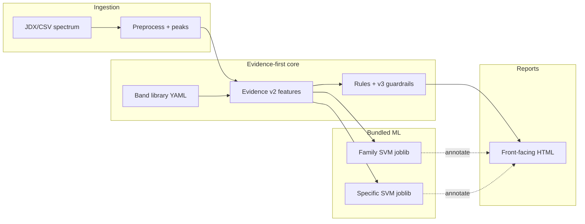
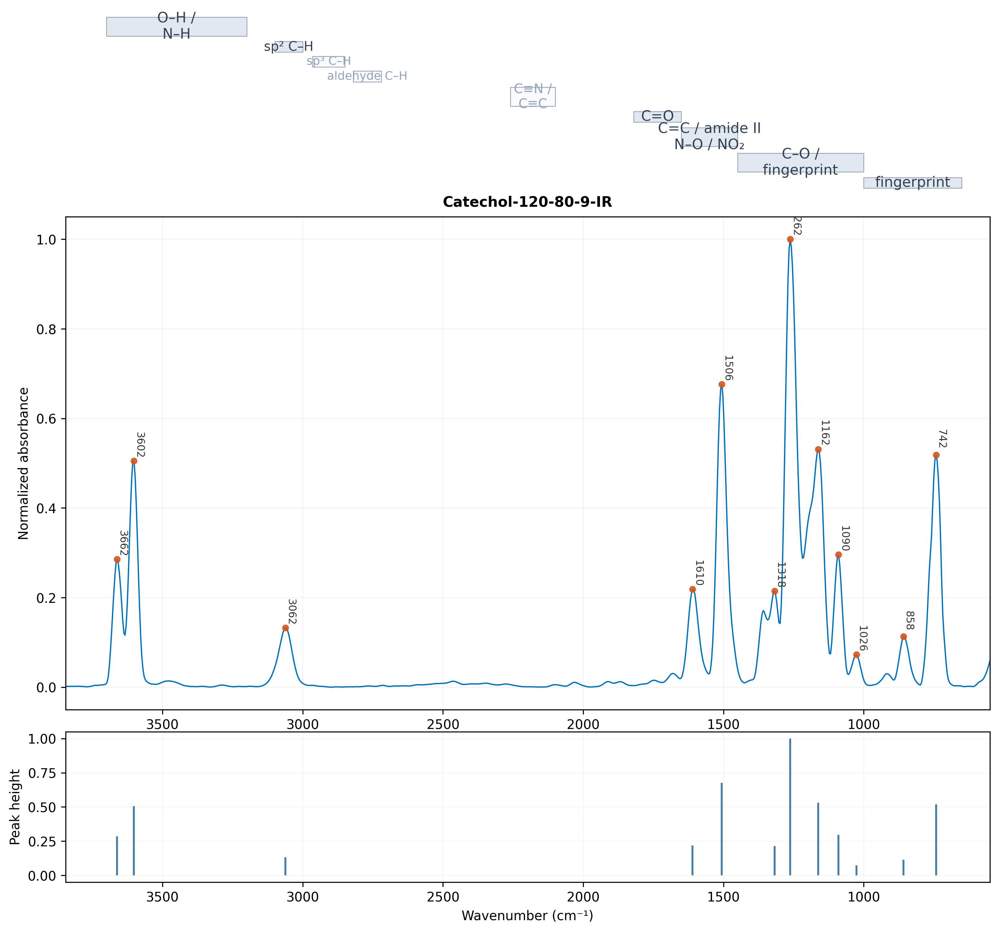

# SpectraReason

**Evidence-first, ambiguity-aware FTIR interpretation** with explainable spectroscopy
reports and optional machine-learning advisory layers.

SpectraReason is **not** a black-box classifier. Rules and band evidence drive
supported vs tentative calls; calibrated SVMs add **advisory** scores (`fusion-mode annotate`).

> **Local motifs ≠ functional groups ≠ consensus interpretation**

---

## What you get out of the box

This repository includes **ready-to-use ML artifacts** (no NIST rebuild required for
inference or retrain-on-bundled-data):

| Bundle | Location | Use |
|--------|----------|-----|
| **Production SVMs** | `data/training/bundled/v4_production/*.joblib` | Front/debug reports with `--ml-mode both` |
| **v4 training matrices** | `data/training/bundled/v4_production/*.npz` | ~15.6k NIST spectra, **434-D** `spectral+evidence_v2` |
| **PubChem cache** | `data/training/bundled/v4_production/pubchem_train_writable.json` | Structures used for SMARTS weak labels at build time |
| **Legacy v7 (Mordred)** | `data/training/bundled/v7_mordred/` | **303-D** spectral+RDKit+Mordred NPZ + v7 joblib |

**Not in git:** NIST SQLite index (~GB). Optional local symlink: `data/external/nist_index.sqlite`.

Details: [`data/training/bundled/README.md`](data/training/bundled/README.md) · [`docs/ML_ARTIFACTS.md`](docs/ML_ARTIFACTS.md)

---

## Quickstart (with ML)

```bash
git clone https://github.com/glsalierno/SpectraReason.git
cd SpectraReason
python -m venv .venv
source .venv/bin/activate          # Windows: .\.venv\Scripts\Activate.ps1
pip install -r requirements.txt
export PYTHONPATH="$(pwd)"         # Windows: $env:PYTHONPATH = (Get-Location).Path

# Install bundled joblibs into ml/runs/ (expected paths for reports)
./scripts/setup_bundled_artifacts.sh   # Windows: .\scripts\setup_bundled_artifacts.ps1

python reports/structural_fg_svm_kronecker_report.py batch \
  --inputs examples/spectra/Catechol-120-80-9-IR.jdx \
  --ontology v4 --guardrails v3 --ml-mode both \
  --family-model ml/runs/struct_fg_family_v4_ontology_latest.joblib \
  --specific-model ml/runs/struct_fg_specific_v4_ontology_latest.joblib \
  --fusion-mode annotate --ml-guardrails strict \
  --report-style product_v1 --report-audience front \
  --visual-theme matlab --show-region-ruler \
  --out reports/demo_front/REPORT.html
```

Open `reports/demo_front/REPORT.html` in a browser.

---

## Philosophy

| Layer | Role |
|-------|------|
| **Local motifs** | Regional spectral patterns (windows, not final FG calls) |
| **Functional groups** | Rule- and band-supported assignments |
| **Consensus** | Spectroscopist-facing summary with explicit ambiguity |
| **ML advisory** | Optional OvR SVM probabilities; **annotate** does not override rules |

Production defaults: ontology **v4**, guardrails **v3**, fusion **annotate**.  
See [`docs/PRODUCTION_DEFAULTS.md`](docs/PRODUCTION_DEFAULTS.md).

---

## Architecture



**v4 SVM inputs (434-D):** 14 spectral window stats + 419 evidence-v2 columns + structure flag.  
**v7 legacy (303-D):** adds RDKit + Mordred descriptor blocks — see `data/training/bundled/v7_mordred/`.

---

## Screenshot



Interactive bundle: [`reports/reference_snapshots/front/REPORT.html`](reports/reference_snapshots/front/REPORT.html)

---

## Repository layout

```
SpectraReason/
├── data/training/bundled/   # ★ joblibs, NPZ matrices, PubChem cache (in git)
├── ml/                     # ontology, evidence, rules, train/predict code
├── reports/                # HTML generators + reference_snapshots/
├── examples/spectra/       # demo spectra (public/literature)
├── configs/                # rule presets
├── docs/                   # commands, reproducibility, ML_ARTIFACTS
├── scripts/                # setup_bundled_artifacts.* 
└── ml/tests/
```

---

## Retrain on bundled data (no NIST)

```bash
python -m ml.structural_fg_svm train \
  --dataset-prefix data/training/bundled/v4_production/ds_v4_family_spectral_evidence_v2_nist \
  --ontology v4 --model-kind family --out ml/runs
```

Full NIST rebuild: [`docs/COMMANDS.md`](docs/COMMANDS.md) · [`docs/EXTERNAL_DATASETS.md`](docs/EXTERNAL_DATASETS.md)

---

## Documentation map

| Doc | Topic |
|-----|--------|
| [`docs/COLLABORATOR_QUICKSTART.md`](docs/COLLABORATOR_QUICKSTART.md) | Clone, setup, demo |
| [`docs/ML_ARTIFACTS.md`](docs/ML_ARTIFACTS.md) | Models, NPZ layouts, v4 vs v7 |
| [`docs/REPRODUCIBILITY.md`](docs/REPRODUCIBILITY.md) | Hashes, frozen defaults |
| [`METHODS.md`](METHODS.md) | Methods text / feature dimensions |
| [`data/README_DATA.md`](data/README_DATA.md) | Data policy |

---

## Environment

| Item | Notes |
|------|--------|
| **Python** | 3.10+ (3.11 recommended on Windows) |
| **RDKit** | Required for SMARTS label rebuilds; optional for report-only |
| **Plotly** | Interactive reports |
| **Git LFS** | Large `.npz` / PubChem JSON use LFS — run `git lfs install` after clone |

`requirements.txt` · optional `environment.yml`

---

## Contributing

Read [`CONTRIBUTING.md`](CONTRIBUTING.md). Lab-only spectra stay in `data/experimental/` (gitignored).

---

## Citation

Cite the git commit from report metadata and `docs/PRODUCTION_DEFAULTS.md`. Methods: [`METHODS.md`](METHODS.md).
