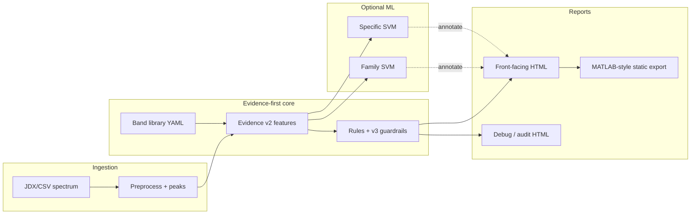

# SpectraReason

**Evidence-first, ambiguity-aware FTIR interpretation** with explainable spectroscopy
reports and optional machine-learning advisory layers.

SpectraReason is **not** a black-box classifier. It separates what the spectrum
*shows locally* from what chemistry *might mean*, and only then forms a cautious
consensus interpretation.

> **Local motifs ≠ functional groups ≠ consensus interpretation**

---

## Philosophy

| Layer | Role |
|-------|------|
| **Local motifs** | Regional spectral patterns (e.g. nitrile/alkyne window activity) |
| **Functional groups** | Rule- and band-supported chemical assignments |
| **Consensus** | Spectroscopist-facing summary with explicit ambiguity |
| **ML advisory** | Optional calibrated SVM scores; **annotate** mode does not override rules |

Production defaults: ontology **v4**, guardrails **v3**, fusion **annotate**,
`product_v1` front-facing reports. See [`docs/PRODUCTION_DEFAULTS.md`](docs/PRODUCTION_DEFAULTS.md).

---

## Architecture



**Interactive features:** local peak hover context, FTIR region ruler (1450–1650 cm⁻¹
amide II / C=C / N–O ambiguity), optional pseudo-Voigt deconvolution for experiments.

---

## Screenshot

Front-facing report (Catechol example, MATLAB theme):


Interactive bundle: [`reports/reference_snapshots/front/REPORT.html`](reports/reference_snapshots/front/REPORT.html)  
More previews: [`docs/assets/screenshots/`](docs/assets/screenshots/).

---

## Quickstart

```bash
git clone <private-repo-url> SpectraReason
cd SpectraReason
python -m venv .venv
source .venv/bin/activate          # Windows: .\.venv\Scripts\Activate.ps1
pip install -r requirements.txt
export PYTHONPATH="$(pwd)"         # Windows: $env:PYTHONPATH = (Get-Location).Path

# Demo front-facing report (rules-only if ML joblibs not present locally)
python reports/structural_fg_svm_kronecker_report.py batch \
  --inputs examples/spectra/Catechol-120-80-9-IR.jdx \
  --ontology v4 --guardrails v3 --ml-mode both \
  --family-model ml/runs/struct_fg_family_v4_ontology_latest.joblib \
  --specific-model ml/runs/struct_fg_specific_v4_ontology_latest.joblib \
  --fusion-mode annotate --ml-guardrails strict \
  --report-style product_v1 --report-audience front \
  --visual-theme matlab --show-region-ruler \
  --out reports/demo_front/REPORT.html
```

Full command reference: [`docs/COMMANDS.md`](docs/COMMANDS.md) · Onboarding: [`docs/COLLABORATOR_QUICKSTART.md`](docs/COLLABORATOR_QUICKSTART.md).

---

## Repository layout

```
SpectraReason/
├── ml/                    # ontology, evidence, rules, guardrails, training
├── reports/               # HTML report generators + reference_snapshots/
├── lib/                   # spectrum I/O and peak utilities
├── configs/               # rule presets (conservative, sensitive, …)
├── examples/spectra/      # collaborator-safe demo spectra
├── data/benchmark_sets/   # manifests only (no proprietary libraries)
├── data/external_sources/ # ingestion stubs + provenance docs
├── docs/                  # reproducibility, commands, benchmarks
├── tools/                 # maintenance utilities (vulture whitelist)
└── tests/                 # → ml/tests/
```

**Not committed:** NIST SQLite indexes, trained `.joblib` / `.npz`, experimental
powder libraries, or generated report clutter (`reports/_archive/`, local `ml/runs/`).

---

## Reproducibility

Each `product_v1` HTML report embeds a collapsible reproducibility JSON block
(ontology version, band-library hash, model SHA-256 prefixes, package versions).

See [`docs/REPRODUCIBILITY.md`](docs/REPRODUCIBILITY.md) and regenerate reference bundles:

```bash
python scripts/release_stabilize.py --snapshots-only
```

---

## External data & benchmarks

- Ingestion framework and legal boundaries: [`docs/EXTERNAL_DATASETS.md`](docs/EXTERNAL_DATASETS.md)
- Confounder-aware benchmark philosophy: [`docs/BENCHMARK_PHILOSOPHY.md`](docs/BENCHMARK_PHILOSOPHY.md)
- Release summary (v5): [`docs/RELEASE_NOTES_v5.md`](docs/RELEASE_NOTES_v5.md)

---

## Environment

| Item | Notes |
|------|--------|
| **Python** | 3.10+ (3.11 recommended on Windows) |
| **RDKit** | Required for SMARTS weak labels and structure-aware training |
| **Plotly** | Interactive reports |
| **Kaleido** | Optional static Plotly export (`pip install kaleido`) |
| **MATLAB** | Optional; reads CSV exports from `matlab_export/` |

Details: `requirements.txt`, `requirements-dev.txt`, optional `environment.yml`.

---

## Contributing

Private collaborators: read [`CONTRIBUTING.md`](CONTRIBUTING.md) and
[`SECURITY.md`](SECURITY.md). Do not commit proprietary spectra or licensed libraries.

---

## Citation

When publishing, cite the repository commit hash from the report metadata block and
document production flags from `docs/PRODUCTION_DEFAULTS.md`. Methods detail: [`METHODS.md`](METHODS.md).
